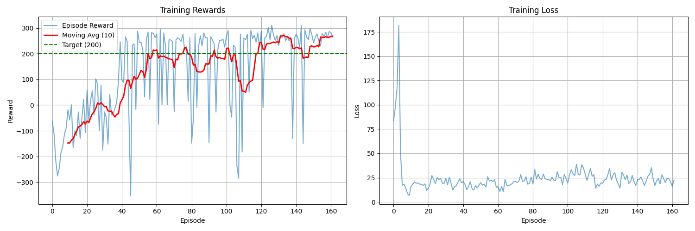
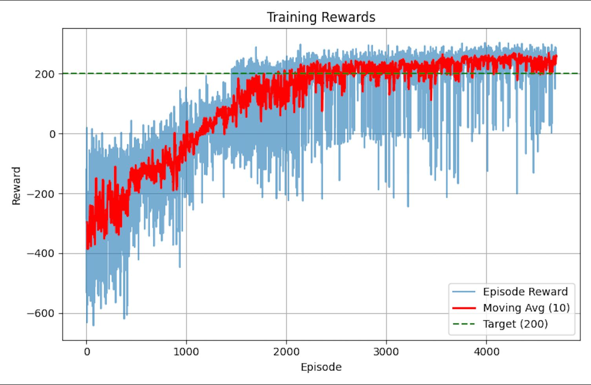

<h1 align="center">Deep RL Showdown: DQN vs PPO on LunarLander</h1>

<p align="center">
  <a href="LICENSE"></a>
  
  
</p>

---

## 🎯 Overview

This project provides a **comprehensive comparison** between two fundamental Deep RL paradigms applied to the challenging **LunarLander-v2** environment:

* **DQN (Deep Q-Network)**: Value-based approach with experience replay and target networks
* **PPO (Proximal Policy Optimization)**: Policy gradient method with clipped surrogate objective
* **Empirical analysis** of convergence speed, sample efficiency, stability, and hyperparameter sensitivity

Our implementation explores the theoretical and empirical trade-offs between these approaches, providing insights into when to use each algorithm.

<p align="center">
  
</p>

---

## 📑 Table of Contents

1. [Environment](#environment)
2. [Theoretical Background](#theoretical-background)
3. [Methodology](#methodology)
4. [Experiments & Results](#experiments--results)
5. [Quick Start](#quick-start)
6. [Analysis & Insights](#analysis--insights)
7. [References](#references)

---

## Environment

**LunarLander-v3** is a classic control task from OpenAI Gym where an agent must safely land a lunar module on a landing pad.

**State Space** (8-dimensional continuous):
* Position (x, y)
* Velocity (vₓ, vᵧ)
* Angle, angular velocity
* Left/right leg ground contact (binary)

**Action Space** (4 discrete actions):
* 0: Do nothing
* 1: Fire left engine
* 2: Fire main engine
* 3: Fire right engine

**Reward Structure**:
* Moving toward/away from landing pad: +/- reward
* Crash: -100
* Successful landing: +100
* Leg ground contact: +10 each
* Fuel consumption: -0.3 per firing

**Success Criterion**: Average reward ≥ 200 over 100 consecutive episodes

---

## Theoretical Background

### DQN (Deep Q-Network)

DQN approximates the optimal action-value function Q*(s,a) using a deep neural network.

**Bellman Optimality Equation**:

Q^{*}(s,a) = \mathbb{E}\Big[r + \gamma \max_{a'} Q^{*}(s', a') \,\Big|\, s, a \Big]


**Loss Function**:

$$L(\theta) = \mathbb{E}_{(s,a,r,s') \sim \mathcal{D}} \left[ \left( r + \gamma \max_{a'} Q(s', a'; \theta^-) - Q(s, a; \theta) \right)^2 \right]$$

**Key Components**:
* **Experience Replay**: Break temporal correlations by sampling from replay buffer $\mathcal{D}$
* **Target Network** $\theta^-$: Stabilize learning by fixing targets for C steps
* **ε-greedy exploration**: Balance exploration/exploitation


---

### PPO (Proximal Policy Optimization)

PPO directly optimizes a stochastic policy $\pi_\theta(a|s)$ using policy gradients with conservative updates.

**Clipped Surrogate Objective**:

$$L^{\text{CLIP}}(\theta) = \hat{\mathbb{E}}_t \left[ \min \left( r_t(\theta) \hat{A}_t, \text{clip}(r_t(\theta), 1-\epsilon, 1+\epsilon) \hat{A}_t \right) \right]$$

where:
* $r_t(\theta) = \frac{\pi_\theta(a_t|s_t)}{\pi_{\theta_{\text{old}}}(a_t|s_t)}$ (probability ratio)
* $\hat{A}_t$ = advantage estimate (Q - V baseline)
* $\epsilon$ = clip range (typically 0.2)

**Key Components**:
* **Advantage estimation**: GAE (Generalized Advantage Estimation) for variance reduction
* **Multiple epochs**: Reuse collected data K times (sample efficiency)
* **Entropy bonus**: Encourage exploration via $-\beta \mathcal{H}(\pi)$


---

## Methodology

### DQN Implementation

**Network Architecture**:
```
* Input layer: 8 → 128 (state dimension to hidden)
* Hidden layer: 128 → 128 with ReLU activation
* Output layer: 128 → 4 (Q-values for each action)
* Simple feedforward design for value approximation
```

**Hyperparameters**:
* Replay buffer size: 100,000
* Batch size: 256
* Learning rate: 5e-4 (Adam)
* Target network update: Every 1,000 steps
* γ (discount): 0.99
* ε decay: 1.0 → 0.01 over 10,000 steps

**Training Procedure**:
1. Collect transition (s, a, r, s') using ε-greedy
2. Store in replay buffer
3. Sample random minibatch
4. Compute TD target using target network
5. Update Q-network via gradient descent
6. Periodically copy weights to target network

---

### PPO Implementation

**Actor-Critic Architecture**:
```
* **Separate actor and critic networks** (no shared layers)
* Actor: 8 → 64 → 64 → 4 (outputs action logits)
* Critic: 8 → 64 → 64 → 1 (outputs state value)
* **Layer Normalization** after each hidden layer for training stability
* **Tanh activation** (smoother gradients than ReLU for policy optimization)
* **Orthogonal initialization** (Engstrom et al., 2020) for faster convergence
* Categorical distribution over discrete actions
```

**Hyperparameters**:
* Rollout length: 2,048 steps
* Epochs per rollout: 10
* Minibatch size: 64
* Learning rate: 3e-4 (Adam)
* γ (discount): 0.99
* GAE λ: 0.95
* Clip range ε: 0.2
* Entropy coefficient: 0.01

**Training Procedure**:
1. Collect N-step rollout using current policy
2. Compute advantages via GAE
3. For K epochs:
   * Sample minibatches from rollout
   * Update actor via clipped objective
   * Update critic via MSE loss
4. Repeat

---

## Experiments & Results

All experiments run for **1M timesteps** with 3 random seeds. Evaluation performed every 10k steps over 10 episodes.

### Convergence Speed

| Algorithm | Steps to 200 | Steps to Optimal (>240) | Figure |
|-----------|-------------:|------------------------:|:------:|
| **DQN**   | ~450k | ~700k |  |
| **PPO**   | **~300k** | **~500k** |  |


**Key Observations**:
* PPO reaches success threshold ~33% faster
* DQN shows more variance early in training
* PPO exhibits smoother, more monotonic improvement

---

**DQN sensitive to**:
* Target network update frequency
* Replay buffer size
* Learning rate

**PPO robust to**:
* Clip range ε (works well in [0.1, 0.3])
* Learning rate variations
* Rollout length

---

## Quick Start

### Installation
```bash
# Create conda environment
conda create -n lunar-rl python=3.11
conda activate lunar-rl

# Install dependencies
pip install -r requirements.txt
```

## Analysis & Insights

### When to Use DQN?

✅ **Discrete action spaces**  
✅ **Off-policy learning required** (learn from demonstrations)  
✅ **High replay ratio desired** (maximize data reuse)

❌ Continuous actions (requires modifications)  
❌ Need for fast convergence  
❌ Limited hyperparameter tuning budget

---

### When to Use PPO?

✅ **Continuous OR discrete actions**  
✅ **Need stability and robustness**  
✅ **Quick prototyping** (works out-of-the-box)  
✅ **Stochastic policies beneficial**

❌ Sample efficiency absolutely critical  
❌ Cannot collect rollouts in parallel

---

### Key Takeaways

1. **PPO dominates for LunarLander**: Faster convergence, better stability, less tuning required
2. **DQN competitive but harder**: Requires careful hyperparameter selection
3. **Variance reduction matters**: GAE + value baseline crucial for PPO's performance
4. **Target networks essential**: DQN unstable without them


## Acknowledgments

* OpenAI Gym for the LunarLander-v3 environment
* Stable-Baselines3 for reference implementations
* The Deep RL community for valuable discussions
